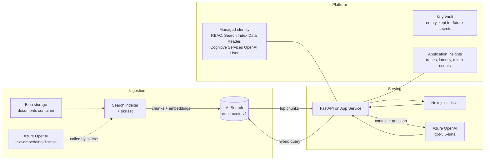

# Enterprise knowledge assistant (Azure RAG)

A RAG chatbot over 11 company documents (HR, Finance, IT, Legal, Sales policies and pricing). Users ask questions in plain English, the app retrieves the right chunks from Azure AI Search, and a GPT model on Azure OpenAI answers with citations. If the documents do not cover the question, the bot says so instead of guessing.

Backend is Python (FastAPI). Frontend is a small Next.js chat. Everything authenticates with managed identity, so there are no API keys in config anywhere.

Live demo and repo layout are covered below.

## Run it

```bash
pip install -r requirements.txt
cp .env.example .env   # fill in your endpoints, see below
uvicorn main:app --port 8000
```

Env vars:

```
AZURE_SEARCH_ENDPOINT=https://<your-search>.search.windows.net
AZURE_SEARCH_INDEX=documents-v1
AZURE_SEARCH_SEMANTIC_CONFIG=documents-v1-semantic-configuration
AZURE_OPENAI_ENDPOINT=https://<your-foundry>.cognitiveservices.azure.com/
AZURE_OPENAI_CHAT_DEPLOYMENT=gpt-5.6-luna
# optional, turns on tracing:
APPLICATIONINSIGHTS_CONNECTION_STRING=...
```

Locally `DefaultAzureCredential` picks up your `az login`. In Azure it picks up the web app's managed identity.

Frontend: `cd web && npm install && npm run dev`. For production the Next.js app is built as a static export (`output: "export"`) and FastAPI serves it from the same origin, so one App Service hosts UI and API together.

## The pipeline

```
documents (blob, private container)
   |
   v
Azure AI Search indexer + skillset      (chunks the docs, embeds each chunk
   |                                      with text-embedding-3-small)
   v
index documents-v1                      (chunk, title, parent_id, text_vector,
   |                                      semantic config)
   v
query time: hybrid search
   text query (BM25) + vector query, fused by RRF
   then semantic ranker rescores the top candidates
   |
   v
post-processing in rag.py
   role filter (OData on parent_id), version dedup,
   reranker score threshold, confidence label
   |
   v
gpt-5.6-luna with the chunks as context
   |
   v
grounded answer, [Title] citations checked against
what was actually retrieved
```

Ingestion is the portal-configured indexer with integrated vectorization. I used the managed indexer instead of writing a custom parser/chunker/embedder because it does exactly those steps already, tracks file changes, and re-runs only on new blobs. For this corpus size there was no reason to build that by hand.

## Architecture



Choices I would defend in review:

- Why Azure AI Search and not a vector database: I get BM25, vectors, fusion, semantic reranking, indexers, and RBAC in one managed service. With pgvector or Cosmos I would be rebuilding the reranker and the ingestion scheduler myself.
- Hybrid, not pure vector: these docs are full of exact tokens like "$25", "macOS", plan names. Vector search alone is weak on exact matches, BM25 alone is weak on paraphrases. Hybrid plus the semantic ranker covers both, and the eval numbers back that up.
- Keyless everywhere. Managed identity plus RBAC roles. Key Vault exists but holds nothing, which is the right amount of secrets.
- One App Service for UI and API. The UI is a static export, so there is nothing to scale separately at this size.
- Scale path: at 10k documents nothing changes except maybe moving Search from Basic to Standard. At 10 million documents I would shard indexes by department, use multiple partitions and replicas, put ingestion on a queue with change detection, and cache more aggressively at the API layer. The query path stays the same.

## Step 3: the failure scenarios and what I did

**1. Correct document, wrong chunk.** Root cause with vector-only retrieval is usually chunk boundaries cutting the answer or paraphrase mismatch. My fix: hybrid ranking in a single query, then the semantic ranker, then a hard threshold on the reranker score. Anything below 2.0 does not reach the prompt.

**2. Answers spread across sections.** The fix is mostly top-k and the citation validator. Top-k is 5, which covers "compare X and Y" questions because both chunks land in the window. The prompt tells the model to cite each claim, and `cited_sources()` only accepts citations that match a title that was actually retrieved, so a half-answered comparison is visible.

**3. Old version wins.** I have Pricing2025 and Pricing2026 in the corpus. If the question names a year, we keep whatever matches. If it does not, we group chunks by document base name and keep only the newest year. Pricing questions now answer from 2026 by default. The eval has one case for each direction.

**4. Questions with no answer.** Two layers. If retrieval returns nothing above threshold, the API refuses without calling the LLM at all. If retrieval returns weak chunks, the system prompt requires the exact refusal sentence and forbids citations. Refusal accuracy in eval went from 0.93 to 1.0.

**5. Ambiguous questions.** I chose clarify over guess. "What is the limit?" retrieves chunks about several limits, and the prompt rule says: if several meanings are possible, ask which one. The bot answers "Which limit do you mean: client meals, team meals, software subscriptions, ...?" instead of silently picking one. Inferring from history happens too, but only when history exists.

**6. Follow-up questions.** Raw history pasted into the search query pollutes retrieval, so I do not do that. Instead a cheap LLM call rewrites the follow-up into a standalone question ("What about Standard?" becomes "What is the Standard plan cancellation policy?"), that rewritten query goes to search, and only the short history goes to the answer model for tone. Retrieval stays clean.

## Step 4: evaluation

Dataset: 14 cases in `eval/dataset.json` covering straightforward, multi-document, versioning, no-answer, ambiguous, follow-up, and access-control questions. Runner: `eval/run_eval.py`, hits the live API, checks expected documents in retrieval, refusal correctness, forbidden-document leaks, keyword presence, latency, tokens.

Baseline is the same app with `RAG_BASELINE=1`, which turns off rewriting, version dedup, the threshold gate, and the role filter. Same 14 cases, back to back:

| metric | baseline | improved |
|---|---|---|
| retrieval hit rate | 0.90 | 1.00 |
| refusal accuracy | 0.93 | 1.00 |
| access leaks | 2 | 0 |
| keyword coverage | 1.00 | 1.00 |
| avg latency ms | 3386 | 2972 |
| total tokens | 31434 | 20575 |

What moved what: the role filter removed both access leaks. The version dedup removed the 2025 chunks that polluted pricing answers. The threshold gate fixed the one refusal miss, a question with no answer that the baseline tried to answer anyway from weak chunks. Tokens dropped by a third because the refusals no longer call the LLM, and because retrieval sends fewer junk chunks. Latency dropped for the same reason.

## Step 5: the questions

**1. Five chunks retrieved, one relevant.**
Log the reranker scores per chunk first. If all five scores are low and spread out, retrieval itself is weak and I would check chunk size and whether the query needs rewriting. If one score is high and the rest drop off, retrieval is fine and the prompt is over-fed, so lower top-k or add a score cutoff. I would not touch the embedding model until I have at least 20 failing queries logged; swapping models on anecdote is how you get new failures.

**2. Response time 3s to 12s.**
Time each hop separately: rewrite call, search call, LLM call. That split immediately tells you which one moved. In my logs the breakdown is printed per request. Most often it is the LLM: check token counts in App Insights, because longer prompts mean longer time to first token. If search moved, check the service tier and whether semantic ranking got turned on for queries that do not need it. Cache hit rate also tells you if repeat traffic stopped hitting the cache.

**3. 10k documents to 5 million.**
Move Search to Standard with partitions and replicas, shard indexes by department so a query only scans relevant shards, put ingestion on a queue-driven indexer with change detection, add blob lifecycle rules so old versions move to cool storage, and raise cache TTL because the corpus is mostly static. Embedding re-indexing becomes expensive, so model upgrades get staged behind a new index, never in place.

**4. Department access control.**
Enforce it in the search query, not in the prompt and not in post-processing. In this app each role maps to a set of documents, and the API adds an OData filter on parent_id, so an HR user physically cannot retrieve pricing chunks. In real production I would put Entra ID group claims on the token and store a department field on every chunk, then security-trim with filter expressions. Same idea, proper identity source. Prompt-level "please don't answer" is not a control.

**5. Cost spike.**
Token usage is already logged per request, so first find out whether it is prompt tokens (context got bigger, rewrite calls doubled, or top-k crept up), completion tokens (answers rambling), or request count (a retry loop somewhere). Fixes in order: cache repeated questions, drop low-scoring chunks before the prompt, cap context size, move rewrite and simple queries to a smaller deployment, keep the big model for the final answer only. Embeddings are cheap and re-embedding is rare, they are almost never the cause.

**6. Occasionally wrong answer with a valid-looking citation.**
I assume the citation is valid because the title matches, not because the content supports the claim. Debug offline, not in production chat: capture the exact question, the retrieved chunks, and the prompt from App Insights. Then walk it. Did the right chunk get retrieved? If no, it is a retrieval bug. If yes, did the right chunk survive the threshold and version dedup? If yes, read the prompt and ask whether the model had enough room and the citation was actually supported by that chunk's text. Most of the time the chunk is relevant to the topic but does not contain the specific fact, and the model bridges the gap. That is why the eval has cases that check the answer text against required keywords and not just the cited title; title-only citation checks pass exactly these bad answers.

## Repo layout

```
main.py            FastAPI app: /api/ask, /api/chat (SSE), /health
rag.py             retrieval, rewriting, versioning, access filter, cache, guardrails
config.py          env vars and constants, role -> document map
observability.py   App Insights wiring, console fallback
eval/              dataset.json, run_eval.py, results/{baseline,improved}.json
web/               Next.js chat UI (static export in production)
```

The demo runs at `https://analytosragweb8421-evfxasc8dzdba6cp.canadacentral-01.azurewebsites.net`.
